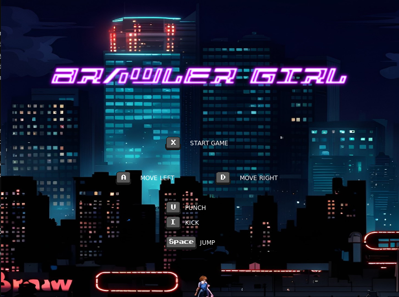

# BRAWLER GIRL GAME
### Video Demo: <url here>
### Description: A 2D _beat 'em up_ small scale game using Love2D and Lua.
Brawler Girl is a small scale / prototype video game and falls under the beat 'em up category. Beat 'em games are one of my favourite genres of game and was very popular back in the 90s with games like Streets of Rage, Final Fight and many others.
Being a small-scale game, Brawler girl only contains 1 main character and one enemy.

### Objective
The objective of the game is score as many points as possible. Being a small scale game, the game only contains 1 main Character and 1 Enemy that respawn stronger each time you defeat him. You only have 1 life to score as many points as possible. Points are scored per hit on the enemy. Each time the Enemy is defeated, it respawn with improved HP, giving more opportunities to score points but also making it harder to beat each time. The enemy will hit back!

### Design
The game takes place in a urban environment with neon-heavy theme. The intro screen and stage background were created using AI art tools. The sprites and other graphics as well as soundtrack were acquired via licence free websites that provide game assets for creators.
The choice for AI art and free assets was both financial and taking time constraints in consideration. Given this is not a commercial project, I deemed these choices to be valid. No AI was used to generate any of the code whatsoever.

Credits are displayed on the game over screen.

## Files and Game Architecture details

The overall Game Architecture is based on Classes. Using an external Lua class module called **_classic_**.
Both the main character and Enemy were built as classes and have their own attributes that is then handled in main.lua

[classic Class Module for Lua](https://github.com/rxi/classic/blob/master/classic.lua)


The Game starts with a title screen displaying the title, background image, game name and controls on how to move the main Character.




### Player Mechanics
The main Character can walk forwards in both directions, jump in both direction, punch and kick.
The Character health bar is display at the top of the screen.
There is also a FPS meter and a Score tracker.

The choice for these mechanics was to capture the basics look and feel of a beat 'em up game but also avoid over complications due to time constraints and lack of experience. Things like special moves, multiple lives, health upgrades were left out of the Character design decision.

### Enemy Mechanics
The Enemy spawns at the opposite side of the screen to the main character. Each time the enemy is defeated, it respawns at the same position but with improved health.
The enemy chases down the main character and, when it reaches their position, it fights. The Enemy is controlled by a simple code that always check for its position relative to the main character and will attempt to punch the character if their positions collide. There is a small delay between each Enemy punch which adds a small sense of randomness of when the punch is coming.

# main.lua
This is the main file of the game. This file is mainly responsible for loading all the necessary components and checking states of each Class (Enemy and Character) and updating their values based on user input and or position and damage taken.

- love.load() function
    - This function loads all required assets for the game functionality and initializes the Enemy and main character instances.

```
function love.load()
    Object = require "classic"
    require "character"
    require "enemy"
    Music = love.audio.newSource("sound/blow-up-that-exekat-main-version-02-40-15156.mp3", "stream")
    Stage1 = love.graphics.newImage("stage1.jpg") -- Background image for 1st stage.
    P1 = Character(500, 30, 470, 120, 30, 100, 150, 250, 550, 100) -- Character instance
    Enemy = Enemy() -- Enemy instance.
    Titlescreen = love.graphics.newImage("titlescreen.jpg")
    GameName = love.graphics.newImage("gameName.png")
    GirlHurt = love.audio.newSource("sound/girlHurt.mp3", "static")
    Defeated = love.audio.newSource("sound/gameOver.mp3", "static")
    GameOverBanner = love.graphics.newImage("game_over_banner.png")

end

```

- love.update() function
    - Handles all interactions between the main Character Class and Enemy Class. It also handles the algorithm for the Enemy behaviour and handles the appropriate attribute's states for either Class depending on position, user input, damage taken etc.
    For example:
        - Enemy Algorithm to chase the main character position and prepare to fight once it collides with the player position:
        ```
         if Enemy.x > P1.x and Enemy.dead == false then
            Enemy.walk = true
            Enemy.punch = false
            Enemy.facing = "left"
            Enemy.x = Enemy.x - 50 * dt
        else
            -- If the enemy reaches the character position, stop walking and set for fight.
            Enemy.walk = false
            if timeElapsed < delay and Enemy.dead == false then
                Enemy.punch = false
                timeElapsed = timeElapsed + dt
                EnemyPunchCounter = 0
            elseif timeElapsed > delay and timeElapsed < delay + 0.3 and Enemy.dead == false then
                Enemy.punch = true
                timeElapsed = timeElapsed + dt
                EnemyPunchCounter = 1
            else
                Enemy.punch = false
                timeElapsed = 0
                EnemyPunchCounter = 0
            end
        end
        ```
        Note that the snippet above handles the position of the enemy sprite based on the main character position, which is controlled by the human player. It also changes states of the Enemy class based on what the enemy class was designed to do.

        This function also handles damage taken by both Enemy and main Character, calculate their health, checks if either have been defeated, play sound effects, ends the game if the main character has been beaten and so forth.

- love.draw() function
    - the draw function within main.lua the graphics for the game that are general and not related to the enemy or main character classes, those are handled on their own file.
    Here the code controls the _title screen_ if the game has not started, draws the background of _Stage 1_ when the game starts, _FPS meter_, _Score counter_, main character's _health bar_. It also handles the _Game Over_ Screen.

We also have 2 very simple functions at the end **_Hurt(P1, Enemy)_** and **_Enemy_Hurt(P1, Enemy)_**. They take the main character's instance (_P1_) and enemy instance (_Enemy_) as arguments and, their only purpose is to calculate the damage taken by each.
These functions are called within love.update() when the right conditions are met for either the enemy of main character to take damage.

```
-- Reduces the Player health by enemy punch amount for each enemy punch
function Hurt(P1, Enemy)
    P1.hp = P1.hp - Enemy.punchDamage
end
-- Reduces enemy health by player punch / kick amount for each player punch or kick.
function Enemy_Hurt(P1, Enemy)
    Enemy.hp = Enemy.hp - P1.punchDamage
end
```

# character.lua
character.lua holds all the configuration for the main character in the game. It is where we create the class Character using **_classic_** module, set all its attributes, handle all sprite animations for the main character class and handle keyboard inputs from the human player.

it starts by creating a Character object using the _classic_ module.
```
Character = Object:extend()
```
All the character sprites images have to be stored in variables and each frame of the animation is taken from sprite sheets. Each frame is set as a position in a table of frames. This will allow for the animation to take place as we will load one sprite sheet image per frame. For example, the main character jab sprite sheet contains 3 separate images, so each one will be loaded per frame.
```
--Jab Spritesheets
P1_jab = love.graphics.newImage("sprites/Spritesheets/Brawler Girl/jab.png")
local jabFrames = {}

jabFrames[1] = love.graphics.newQuad(0, 0, 93, 63, P1_jab:getDimensions())
jabFrames[2] = love.graphics.newQuad(96, 0, 93, 63, P1_jab:getDimensions())
jabFrames[3] = love.graphics.newQuad(192, 0, 93, 63, P1_jab:getDimensions())

local jab_elapsedTime = 0
local jab_currentFrame = 3
local jab_activeFrame = jabFrames[jab_currentFrame]
--End of jab spritessheets
```
We also have set a few variables that will be useful within the logic for the animation. More on that on love.update() function.

The main Character then has its attributes defined:

```
-- Create a character class with help of classic library.
function Character:new(hp, x, y, height, width, punch, kick, upper, ult, speed)
    self.hp = hp
    self.x = x
    self.y = y
    self.height = height
    self.width = width
    self.punchDamage = punch
    self.kickDamage = kick
    self.upper = upper
    self.ult = ult
    self.speed = speed
    self.jumping = false
    self.jumpSpeedY = 150
    self.initialJumpSpeedY = 150
    self.jumpSpeedX = 150
    self.initialJumpSpeedX = 100
    self.onGround = true
    self.facing = "right"
    self.walk = false
    self.jab = false
    self.kick = false
    self.punchActive = 0
    self.canjab = false
    self.cankick = false
    self.uppercut = false
    self.canupper = false
    self.hurt = false
end
```

- Character:update() function
    - This function handles all character animation according to different states and/or human user input.
    For example, for the main character to walk right, we need the user to press the "d" key on the keyboard, the character should not be jumping, and its position not colliding with the enemy position.
    ```
    -- Character walk to the right
    if love.keyboard.isDown("d") and self.x <= 750 and self.jumping == false and math.floor(self.x) < math.floor(Enemy.x) then
        self.x = self.x + (self.speed * dt)
        self.facing = "right"
        self.walk = true
    else
        self.walk = false
    end
    ```
    The same applies to all other mechanics and it is all handled within the Character:update(dt) function.

    Some animations are not dependent of user input. Those are mainly setting the correct sprite frame, so the Love2D knows what to draw. Those are state dependent, however. For example, the main character can only walk if they are on the ground, this condition is checked and if met, we set the animation loop for the walking sprites. This ensures that the correct sprite is drawn to the screen according to each action the user wants.
    ```
    -- walk animation
    if self.onGround == true then
        walk_elapsedTime = walk_elapsedTime + dt
        if walk_elapsedTime > 0.3 then
            if walk_currentFrame < 4 then
                walk_currentFrame = walk_currentFrame + 1
            else
                walk_currentFrame = 1
            end
            walk_activeFrame = walkFrames[walk_currentFrame]
            walk_elapsedTime = 0
        end
        walk_activeFrame = walkFrames[walk_currentFrame]
    end
    ```
    Note that we are constantly setting the ```walking_activeFrame``` variable, this variable will be passed to the draw function, which will allow the correct to sprite to be drawn.

- Character.draw() function
    - The draw function handles the actual drawing on the screen of the character sprites. Similar to the update function, it also takes states and conditions in order to know what to draw but the difference is that the update function works by setting variables, state and position values and draw() draws them.
    Still on the example of the main character walking, the draw() function will draw the correct sprites given certain conditions are met. We can also see the aforementioned ```walking_activeFrame``` being used:
    ```
        --Walk sprite walking right
    if love.keyboard.isDown("d") and self.x <= 750 and self.onGround == true and self.facing == "right" and self.walk == true and self.jab == false and self.kick == false then
        love.graphics.draw(P1_walk, walk_activeFrame,self.x, self.y, 0, 2.3, 2.3, self.width + 5, self.height -110)
    end
    ```

- keypressed() function
    - The keypressed() function handles all human user inputs during game play. It acts like a light switch, turning states on and off (true or false) according to the input.
    It also handles some sounds like the effect for the punch or kick as those should only play when the user press the punch or kick button. For example:
    ```
    -- Jump conditions. Character can only jump if on the ground
    if key == "space" and P1.onGround and GameStart == true then
        P1.jumping = true
        P1.onGround = false
        P1.jumpSpeedY = P1.initialJumpSpeedY
        P1.jumpSpeedX = P1.initialJumpSpeedX
        love.audio.play(jumpShout)
    end
    -- Character punch mechanics
    if key == "u" and GameStart == true then
        actionInputs.jab = true
        love.audio.play(punchSound)
    end
    -- Character kick mechanics.
     if key == "i" and GameStart == true then
        actionInputs.kick = true
        love.audio.play(kickSound)
     end

     if key == "x" then
        GameStart = true
     end
    end
    ```
    By modifying states of the Character object, it directly affects the draw and update functions.

- keyreleaseed() function
    - Lastly, we have the keyreleassed function, this function completements the keypressed function. It is used to allow for fast inputs to be accounted for without repetition. For example, for the main character's punch, I wated to stop users from simply holding the punch button down and being able to cast infinite number of punches. This is handled by action inputs where the press of the button does not set the punch logic directly but set a state where will allow the character's punch animation to start. The keyreleassed is a safeguard that will also turn the jab state to false when the users let go of the key.
    ```
    function love.keyreleased(key)
        if key == "u" then
            actionInputs.jab = false
        end

        if key == "i" then
            actionInputs.kick = false
        end
    end
    ```


# enemy.lua
Like to character.lua, enemy.lua handles the configurations, animation frames, sprites, a couple of sounds and attributes for the Enemy class.
Although fairly similar to the Character class, there are some impoartant differences which allows the game to achieve its design. As the enemy respawns with improved HP each time it is defeated, its constructor had to account for attributes that would allow that:
```
function Enemy:new()
    self.startX = 500
    self.startHp = 300
    self.powerUp = 1
    self.x = 500
    self.y = 445
    self.hp = 300
    self.height = 100
    self.punchDamage = 50
    self.speed = 50
    self.walk = true
    self.idle = false
    self.facing = "left"
    self.punch = false
    self.hurt = false
    self.dead = false
end
```
Notice the ```self.startX``` , ```self.startHP``` and ```self.powerUp```. Those attributes are used to respawn the enemy sprite once it has been defeted to its original x coordinate and add more HP each time by multiplying ```self.startHP``` by ```self.powerUP``` and increasing ```self.powerUP``` by 1 each time the enemy respawns.
